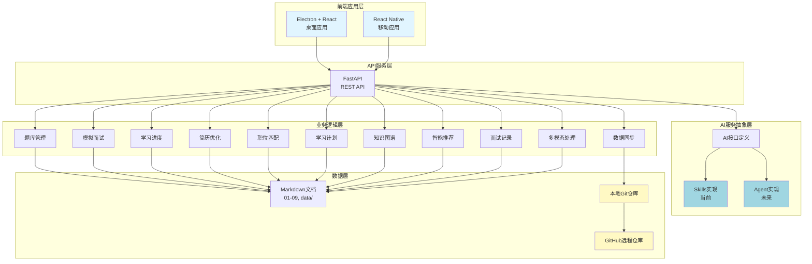
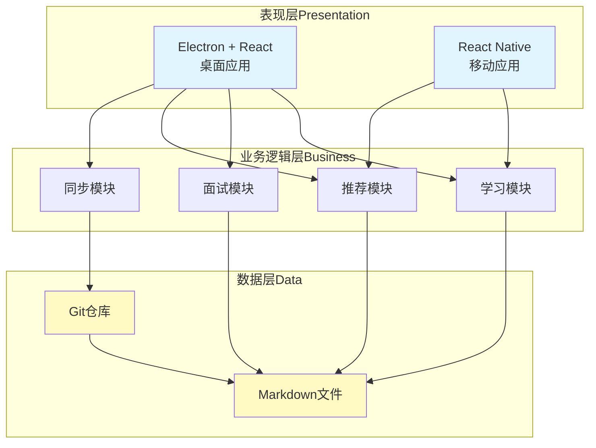
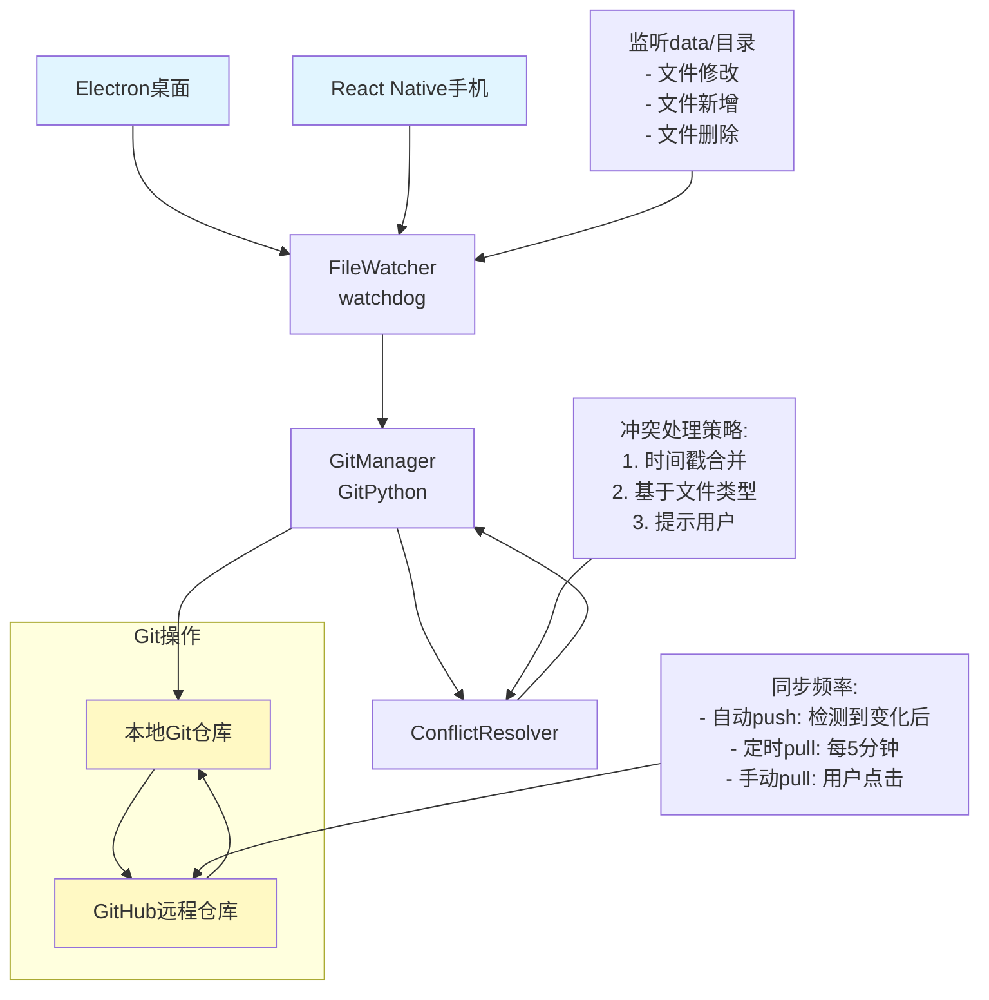

# 求职准备系统 - 未来架构设计

> **⚠️ 重要提示**：本文档描述的是**未来计划**的完整InterviewPrep系统（前端+后端），并非当前实际使用的系统。
> **当前实际系统**：Skills v3.0 (`.github/skills/`) - 完全自主的AI驱动学习和面试准备系统
> **项目名称**：InterviewPrep (AI-Powered Job Interview Preparation System)
> **版本**：v2.0 Future (未来计划)
> **最后更新**：2026-02-07
> **作者**：returnfortheking

---

## 📌 文档说明

### 当前系统 vs 未来计划

| 维度 | 当前系统 (Skills v3.0) | 未来计划 (InterviewPrep) |
|------|----------------------|---------------------|
| **架构** | 纯Markdown + Skills系统 | 前端(React/Electron) + 后端(FastAPI) |
| **使用方式** | Claude Code对话 | 独立应用（桌面/移动） |
| **自动化** | 88% | 95%+ |
| **多设备** | Git同步 | 专用服务器(Mac mini) + API |
| **实施状态** | ✅ 已实施 | 📋 设计完成，待实施 |

### 如何使用本文档

本文档是**未来系统的完整设计文档**，包含：
- 完整的前后端架构设计
- 11个核心模块详细设计
- 数据模型和API设计
- 实施计划（5个阶段）

**如果你想了解当前实际使用的系统，请参考：**
- [README.md](README.md) - 项目主页（已更新为Skills v3.0）
- [.github/skills/README_v3_Autonomous.md](.github/skills/README_v3_Autonomous.md) - Skills v3.0系统说明
- [00_Quick_Start.md](00_Quick_Start.md) - 快速入门指南

---

## 📋 目录

1. [项目概述](#项目概述)
2. [现有系统分析](#现有系统分析)
3. [系统架构](#系统架构)
4. [技术栈](#技术栈)
5. [核心模块设计](#核心模块设计)
6. [数据模型](#数据模型)
7. [实施计划](#实施计划)
8. [面试展示价值](#面试展示价值)

---

## 项目概述

### 目标

构建一个**自动化求职准备系统**，帮助华为工程师（目标：AI IDE/RAG/Agent 岗位）在 6 月 30 日前完成跳槽。

### 核心需求

1. **多端支持**：桌面（Electron + React）+ 移动（React Native）
2. **自动同步**：工作 PC / 私人 PC / 手机 自动 Git 同步
3. **AI 驱动**：集成 Skills 系统 + LLM API
4. **面试准备**：题库、模拟面试、学习计划、进度跟踪
5. **项目展示**：可作为面试项目展示

---

## 现有系统分析

### 核心资产

#### 1. Skills 系统 (.github/skills/)

```
学习工作流：
learning-workflow (Meta-Skill)
├── doc-sync (文档同步 + JD 解析)
├── progress-tracker (进度跟踪)
├── practice (练习生成)
├── summarizer (学习总结)
├── assessor (技能评估)
└── checkpoint (保存 + git commit)
```

**优势**：
- ✅ 模块化设计
- ✅ Registry-based 配置驱动
- ✅ 详细的 SOP
- ✅ 智能路由机制

#### 2. 数据资产

| 目录 | 内容 | 状态 |
|------|------|------|
| `01-09_核心文档.md` | 个人信息、技能评估、市场调研、行动计划 | ✅ 完整 |
| `jd_data/images/` | 15 个 JD 截图 | ✅ 已收集 |
| `practice/` | Python 学习路径 | ✅ 已开始 |
| `conversations/` | 对话历史 | ✅ 有记录 |
| `interview_data/` | 面试数据 | ✅ 有记录 |

#### 3. 5 个 Claude 协作系统

- General（通用助手）- 协调者
- Assessor（测试评估）- 技能测试
- Teacher（教学）- 技术教学
- Researcher（研究）- JD 收集
- Planner（计划协调）- 进度跟踪

### 局限性

| 维度 | 现有系统 | 新需求 |
|------|---------|--------|
| **移动端** | ❌ 仅桌面 | ✅ 需要手机端（通勤使用） |
| **数据同步** | ⚠️ 手动 Git 操作 | ✅ 自动同步（工作 PC + 私人 PC + 手机） |
| **用户体验** | ⚠️ 命令行/VSCode | ✅ 友好的 GUI 界面 |
| **模拟面试** | ⚠️ 基础评估 | ✅ 真实模拟面试（多轮对话） |
| **多模态输入** | ❌ 未实现 | ✅ 图片、语音、代码文件 |
| **智能推荐** | ⚠️ 基于规则 | ✅ 基于薄弱点推荐 |
| **作为面试项目** | ⚠️ 内部工具 | ✅ 可展示的完整系统 |

---

## 系统架构

### 整体架构


或者查看在线渲染：[打开架构图](diagrams/architecture_diagrams.html)



### 三层分离架构




### 自动 Git 同步架构




---

## 技术栈

### 前端技术栈

#### 桌面应用

| 技术 | 版本 | 用途 |
|------|------|------|
| **Electron** | 最新 | 跨平台桌面应用框架 |
| **React** | 18+ | UI 框架 |
| **TypeScript** | 5+ | 类型安全 |
| **Ant Design** | 5+ | UI 组件库 |
| **Zustand** | 4+ | 状态管理 |
| **Vite** | 5+ | 构建工具 |

#### 移动应用

| 技术 | 版本 | 用途 |
|------|------|------|
| **React Native** | 0.73+ | 跨平台移动应用 |
| **TypeScript** | 5+ | 类型安全 |
| **React Native Paper** | 5+ | UI 组件库 |
| **Zustand** | 4+ | 状态管理 |
| **React Navigation** | 6+ | 路由导航 |

### 后端技术栈

| 技术 | 版本 | 用途 |
|------|------|------|
| **FastAPI** | 0.110+ | API 服务框架 |
| **Python** | 3.11+ | 后端语言 |
| **Uvicorn** | 最新 | ASGI 服务器 |
| **GitPython** | 3+ | Git 操作 |
| **watchdog** | 3+ | 文件监听 |
| **Pydantic** | 2+ | 数据验证 |

### AI 集成

| 技术 | 版本 | 用途 |
|------|------|------|
| **OpenAI API** | - | LLM 调用 |
| **Claude API** | - | LLM 调用 |
| **Skills System** | v2.0 | 现有工作流 |
| **LangGraph** | 未来 | Agent 替换方案 |
| **LangChain** | 未来 | RAG 组件 |

### 数据存储

| 技术 | 用途 |
|------|------|
| **Markdown 文件** | 核心数据存储 |
| **Git** | 版本控制 + 同步 |
| **JSON** | 元数据（metadata.json） |

### 开发工具

| 工具 | 用途 |
|------|------|
| **VSCode** | 代码编辑 |
| **Git** | 版本控制 |
| **PlantUML MCP Server** | 架构图生成 |
| **Docker** | 容器化（可选） |

---

## 核心模块设计

### 1. 题库管理模块 (QuestionManager)

**功能**：
- 手动导入题目（文本/Markdown/Excel）
- AI 自动生成题目（基于职位方向和难度）
- 题目分类和标签管理
- 题目搜索和筛选
- 题目导出（支持多种格式）

**AI 能力**：
```python
generate_questions(category: str, difficulty: str, count: int) -> List[Question]
extract_questions_from_file(file_path: str) -> List[Question]
similar_questions(question_id: str) -> List[Question]
```

**数据结构**：
```markdown
---
id: q_rag_001
type: technical
category: RAG
difficulty: medium
tags: ["RAG", "retrieval", "optimization"]
created_at: 2026-02-07
---

# RAG 检索策略优化

## 问题描述
...

## 答案要点
...

## 参考答案
...
```

### 2. 模拟面试模块 (InterviewSimulator)

**功能**：
- 随机抽题（支持分类和难度筛选）
- 实时 AI 对话（支持语音/文字）
- 答案自动评估（评分 + 反馈）
- 多轮追问（深入考察理解）
- 面试报告生成

**AI 能力**：
```python
conduct_interview(
    question: str,
    user_answer: str,
    conversation_history: List[Dict]
) -> InterviewResult

evaluate_answer(answer: str, reference: str) -> Score
generate_followup_questions(topic: str, answer: str) -> List[Question]
```

### 3. 学习进度追踪模块 (ProgressTracker)

**功能**：
- 记录学习历史（题目、时间、分数）
- 掌握度分析（每个技能点的掌握情况）
- 薄弱点识别
- 学习曲线可视化
- 复习提醒（间隔重复算法）

**AI 能力**：
```python
analyze_mastery(user_id: str) -> MasteryReport
identify_weak_areas(learning_records: List) -> List[Topic]
generate_learning_report(weekly: bool) -> LearningReport
```

### 4. 简历优化助手模块 (ResumeOptimizer)

**功能**：
- 简历上传和解析（PDF/Word/Markdown）
- 关键词提取
- 与 JD 匹配度分析
- 优化建议生成
- 简历改写辅助

**AI 能力**：
```python
analyze_resume(resume_text: str) -> ResumeAnalysis
compare_with_jd(resume_text: str, jd_text: str) -> MatchAnalysis
suggest_improvements(resume_text: str, jd_text: str) -> List[Suggestion]
rewrite_section(section: str, improvements: List) -> str
```

### 5. 职位匹配分析模块 (JobMatcher)

**功能**：
- JD 上传和解析
- 技能要求提取
- 用户技能匹配度计算
- 技能差距分析
- 优先级排序

**AI 能力**：
```python
match_job_jd(user_profile: Dict, jd_text: str) -> MatchResult
extract_requirements(jd_text: str) -> List[Requirement]
calculate_skill_gap(user_skills: Dict, job_requirements: List) -> GapAnalysis
```

### 6. 学习计划生成模块 (StudyPlanner)

**功能**：
- 基于目标和差距生成计划
- 分阶段规划（基础/进阶/冲刺）
- 每日任务分配
- 进度跟踪和调整
- 计划模板管理

**AI 能力**：
```python
generate_study_plan(
    user_profile: Dict,
    job_jd: str,
    time_frame: int
) -> StudyPlan

adjust_plan(current_plan: StudyPlan, progress: Dict) -> StudyPlan
estimate_time(topic: str, current_level: int, target_level: int) -> int
```

### 7. 知识图谱构建模块 (KnowledgeGraphBuilder)

**功能**：
- 自动构建知识点关联
- 可视化展示（图形式）
- 学习路径推荐
- 知识点依赖分析

**AI 能力**：
```python
extract_knowledge_entities(content: str) -> List[Entity]
build_relationships(entities: List[Entity]) -> Graph
recommend_learning_path(current_skills: Dict, target_role: str) -> Path
```

### 8. 智能推荐引擎模块 (RecommendationEngine)

**功能**：
- 基于薄弱点推荐题目
- 个性化学习路径
- 相关知识点推荐
- 学习资源推荐

**AI 能力**：
```python
recommend_questions(weak_areas: List[Topic]) -> List[Question]
recommend_resources(topic: str, level: int) -> List[Resource]
personalize_recommendations(user_history: List) -> List[Recommendation]
```

### 9. 面试记录管理模块 (InterviewRecorder)

**功能**：
- 记录真实面试经历
- 面试题目整理
- 自我反思和总结
- 面试结果跟踪
- 面试经验沉淀

**AI 能力**：
```python
organize_interview_notes(notes: str) -> StructuredNotes
analyze_interview_pattern(interviews: List[Interview]) -> Insights
generate_insights(interview: Interview) -> Summary
```

### 10. 多模态输入处理模块 (MultiModalProcessor)

**功能**：
- 图片识别（手写算法题）
- 语音转文字
- 代码文件解析
- 格式转换

**AI 能力**：
```python
ocr_handwriting(image: Image) -> str
speech_to_text(audio: Audio) -> str
analyze_code(code: str) -> CodeAnalysis
```

### 11. 数据同步模块 (DataSyncManager)

**功能**：
- Git 自动 commit
- 冲突检测和解决
- 进度快照
- 增量同步

**技术实现**：
```python
class SyncService:
    def __init__(self, repo_path: str, remote_url: str):
        self.repo = Repo(repo_path)
        self.remote_url = remote_url
        self.observer = Observer()
        self.observer.schedule(
            FileChangeHandler(self),
            repo_path,
            recursive=True
        )
        self.observer.start()

    async def auto_push(self, changed_files: list):
        # 自动 commit + push
        self.repo.index.add(changed_files)
        commit_msg = self._generate_commit_message(changed_files)
        self.repo.index.commit(commit_msg)
        origin = self.repo.remote(name='origin')
        origin.push()

    async def auto_pull(self):
        # 定时拉取
        while True:
            try:
                self.repo.remotes.origin.pull()
                await asyncio.sleep(300)  # 5 分钟
            except Exception as e:
                await asyncio.sleep(60)
```

---

## 数据模型

### 目录结构

```
InterviewPrep/
├── .github/
│   └── skills/              # Skills 系统
│       ├── learning-workflow/
│       ├── doc-sync/
│       ├── practice/
│       ├── assessor/
│       ├── checkpoint/
│       ├── interview-simulator/  # 新增
│       ├── smart-recommender/    # 新增
│       └── registry.yaml
├── config/
│   ├── user_profile.md     # 个人配置
│   └── settings.md        # 系统设置
├── data/
│   ├── questions/          # 题库
│   │   ├── rag/
│   │   ├── agent/
│   │   └── ai_ide/
│   ├── positions/          # 职位信息
│   ├── study_plans/        # 学习计划
│   ├── interviews/         # 面试记录
│   └── knowledge_graph/   # 知识图谱
├── progress/              # 学习进度
│   ├── daily_progress.md
│   ├── weekly_summary.md
│   └── mastery_levels.md
├── practice/              # 练习材料
│   └── python/
├── user_content/           # 用户内容
│   ├── resumes/
│   ├── code_samples/
│   └── notes/
├── backend/               # 后端 API（新增）
│   ├── main.py
│   ├── services/
│   │   ├── ai_service.py
│   │   ├── sync_service.py
│   │   └── file_service.py
│   └── requirements.txt
├── frontend/              # 前端应用（新增）
│   ├── desktop/           # Electron + React
│   └── mobile/            # React Native
├── 01-09_核心文档.md      # 保留
├── diagrams/              # 架构图（新增）
└── README.md
```

### 核心数据结构

#### 用户配置 (config/user_profile.md)

```markdown
---
id: user_001
name: 张三
email: zhangsan@example.com
target_positions:
  - AI IDE Engineer
  - RAG Engineer
  - Agent Developer
tech_stack:
  - Python
  - TypeScript
  - React
  - Node.js
experience_years: 5
github_url: https://github.com/zhangsan
created_at: 2026-02-07
---

# 用户配置
...
```

#### 面试题 (data/questions/rag/001_rag_retrieval_optimization.md)

```markdown
---
id: q_rag_001
type: technical
category: RAG
difficulty: medium
tags:
  - RAG
  - retrieval
  - optimization
attempts: 0
mastery: 0.0  # 0-1
last_attempted: null
---

# RAG 检索策略优化
...
```

#### 学习进度 (progress/daily_progress.md)

```markdown
---
date: 2026-02-07
total_questions_attempted: 5
questions_correct: 4
accuracy: 0.8
---

# 每日学习进度
...
```

---

## 实施计划

### 阶段 1：API 服务开发（1-2 周）

**目标**：搭建轻量级 API，暴露数据访问和 AI 能力

**任务清单**：
- [ ] 搭建 FastAPI 项目
- [ ] 实现 Markdown 文件读写 API
- [ ] 实现现有 Skills 的 API 封装
- [ ] 实现基础 Git 同步 API
- [ ] 编写 API 文档

**可演示**：
```bash
curl http://localhost:8000/api/progress
curl -X POST http://localhost:8000/api/ai/assess \
  -H "Content-Type: application/json" \
  -d '{"topic": "Python闭包", "answers": [...]}'
```

---

### 阶段 2：桌面应用（2-3 周）

**目标**：Electron + React 桌面应用，替代命令行交互

**核心功能**：
- [ ] 仪表盘：显示当前进度、今日任务
- [ ] 题库管理：查看、搜索、筛选题目
- [ ] 练习界面：做练习、查看答案
- [ ] 进度跟踪：可视化展示学习进度
- [ ] 同步按钮：手动触发 Git 同步

**可演示**：
- 独立的桌面应用窗口
- 友好的 GUI 界面
- 实时数据更新

---

### 阶段 3：移动应用（2-3 周）

**目标**：React Native 移动应用，支持通勤学习

**核心功能**：
- [ ] 查看进度和任务
- [ ] 快速练习（选择题、简答题）
- [ ] 记录学习笔记
- [ ] 自动同步（后台）

**可演示**：
- Android 应用
- 离线模式
- 自动同步功能

---

### 阶段 4：增强功能（3-4 周）

**目标**：新增智能功能，提升系统价值

**任务清单**：
- [ ] **模拟面试**：
  - 新增 `interview-simulator` Skill
  - 支持多轮对话
  - 自动评估回答质量

- [ ] **智能推荐**：
  - 新增 `smart-recommender` Skill
  - 基于薄弱点推荐题目
  - 个性化学习路径

- [ ] **多模态输入**：
  - 支持图片上传（手写算法题）
  - 支持代码文件解析
  - 语音转文字（移动端）

- [ ] **自动 Git 同步优化**：
  - 后台服务自动 commit + push
  - 智能冲突处理
  - 同步状态可视化

---

### 阶段 5：项目包装（1-2 周）

**目标**：将系统作为面试项目展示

**任务清单**：
- [ ] 编写项目 README
- [ ] 制作技术架构图
- [ ] 准备 Demo 视频
- [ ] 编写技术博客

---

## 面试展示价值

### 面试不同岗位的展示重点

#### AI IDE 工程师 (如 Trae)

**核心展示**：
- ✅ VSCode Extension API 开发经验
- ✅ IDE 插件架构设计
- ✅ Agent 集成经验
- ✅ 系统架构能力

**技术亮点**：
- Skills 系统的模块化设计
- 自动 Git 同步机制
- 多模态输入处理
- 知识图谱构建

#### RAG 工程师

**核心展示**：
- ✅ RAG 系统架构经验
- ✅ 检索优化策略
- ✅ 向量数据库使用
- ✅ 完整的 RAG 项目

**技术亮点**：
- 智能推荐引擎（基于向量检索）
- 知识图谱构建
- 题库自动生成（基于 LLM）
- 面试评估（RAG 场景）

#### AI Agent 开发

**核心展示**：
- ✅ Agent 工作流设计
- ✅ Skills 系统（模块化 Agent）
- ✅ LangGraph 迁移经验（未来）
- ✅ 多 Agent 协作

**技术亮点**：
- Skills 系统作为 Agent 编排层
- learning-workflow 智能路由
- 状态管理和错误处理
- 多轮对话模拟面试

#### AI Infra

**核心展示**：
- ✅ 系统架构设计
- ✅ 数据同步和版本管理
- ✅ 性能优化（缓存、批处理）
- ✅ 可观测性（监控、日志）

**技术亮点**：
- 自动 Git 同步服务
- 文件监听机制
- 冲突处理策略
- 分布式数据存储（Git + Markdown）

### 项目亮点总结

| 亮点 | 技术深度 | 适用岗位 |
|------|---------|---------|
| **Skills 系统** | ⭐⭐⭐⭐⭐ | 所有 AI 岗位 |
| **自动 Git 同步** | ⭐⭐⭐⭐ | AI Infra |
| **智能推荐引擎** | ⭐⭐⭐⭐ | RAG / Agent |
| **知识图谱** | ⭐⭐⭐ | RAG / Agent |
| **模拟面试系统** | ⭐⭐⭐⭐ | 所有 AI 岗位 |
| **多模态处理** | ⭐⭐⭐ | AI IDE / RAG |
| **全栈开发** | ⭐⭐⭐ | 所有岗位 |

---

## 附录

### 参考资料

- **MODULAR-RAG-MCP-SERVER**: Skills 系统设计灵感
- **LangGraph**: Agent 工作流编排
- **LangChain**: RAG 组件
- **Electron**: 桌面应用开发
- **React Native**: 移动应用开发

### 版本历史

| 版本 | 日期 | 变更 |
|------|------|------|
| v1.0 | 2026-02-07 | 初始版本，基于现有 Skills 系统设计 |
| v2.0 | 2026-02-07 | 增加前后端架构、自动同步、多端支持 |

---

**文档所有者**：returnfortheking
**最后更新**：2026-02-07
**状态**：📋 设计完成，待实施
